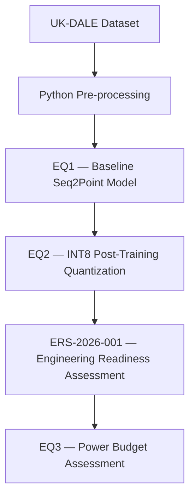

# Workflow

| Stage | Folder | Description |
|---|---|---|
| Dataset | [`datasets/ukdale/`](datasets/ukdale/) | Raw UK-DALE metadata (dataset itself downloaded separately, see [docs/reproducibility.md](docs/reproducibility.md)) |
| Pre-processing | [`preprocessing/`](preprocessing/) | Extracts, aligns and quality-checks meter channel pairs from the raw dataset |
| EQ1 | [`eq1/`](eq1/) | Trains and evaluates the baseline FP32 Seq2Point NILM model |
| EQ2 | [`eq2/`](eq2/) | Applies INT8 post-training quantization and validates it against the EQ1 baseline |
| ERS-2026-001 | [`docs/ERS-2026-001.pdf`](docs/ERS-2026-001.pdf) | The published Engineering Readiness Assessment, built on the EQ1/EQ2 evidence |
| EQ3 | [`eq3/`](eq3/) | Power budget assessment for the resource-constrained Edge AI deployment scenario |

See [docs/RVP-application.md](docs/RVP-application.md) for how this workflow maps onto the four RVP™ stages (Assess, Simulate, Validate, Deploy).
